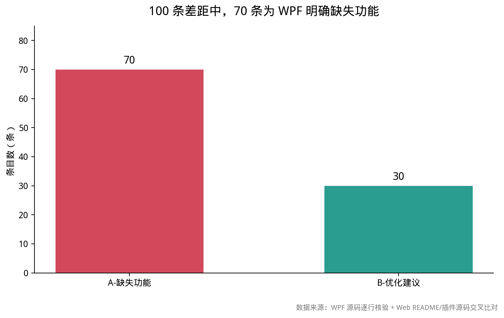
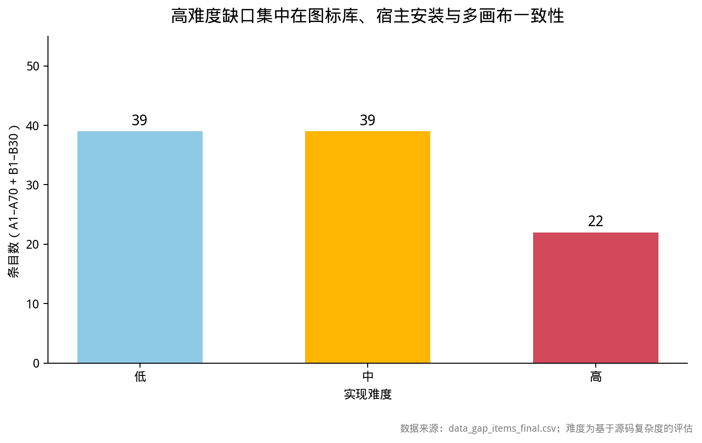

# WPF 脑图功能移植差距清单：100 项差距与实施优先级

## 摘要：差距集中在标签体系、组件宿主与多画布可靠性，Web 版并非简单功能缩水

本次逐行核验确认，WPF 原版与 Web 版之间不是“少量按钮未补”的差距，而是围绕 **标签资产体系、可插拔组件宿主、多画布持久化一致性** 形成了系统性断层。

WPF `MindMapPanel.xaml.cs` 实际为 3070 行，结合 `KityMinderHost`、各类 `Services` 及 `AppConfig`，形成了从编辑器桥接、节点样式、附件、备份、画布管理到设置项的完整闭环。Web 版 README 已经诚实标注复制画布、主题导入导出、外框、排序、备份等已补齐项，并明确排除左栏文件库、文件路径附件等设计性差异；但本次仍识别出 **71 项 WPF 明确缺失功能（A1–A71）** 和 **29 项 Web 现有能力的不一致或细化项（B1–B29）**。

价值最高、应优先实施的是：**A48/A49 自动保存与画布切换的原子性、A3–A10 预设图标资产体系、A68/A69 组件安装宿主、A53–A57 页签拖拽体验，以及 B1–B3 的撤销/复制粘贴/多选一致性**。这些项共同决定 Web 版能否达到日常可依赖的生产工具标准，而不只是“可以打开和编辑脑图”。

本报告将差异分为四类：

- **完全缺失**：Web 版没有对应入口、桥接或可见行为；
- **部分实现**：Web 已有命令或数据结构，但缺少 WPF 的完整交互、边界处理或持久化；
- **有但行为不同**：已刻意重新设计，仍需显式处理兼容或迁移；
- **优化建议**：现有基础较强，但仍未达到 WPF 的交互完整性。

WPF 出处优先使用实际打开的文件与行号；少数通过宿主接口、设置键或同类服务推导的能力，明确标注“未定位到确切行号”，并给出函数名或服务名，避免虚构定位。

*图 1：71 条 A 类缺失与 29 条 B 类优化建议。数据来源：WPF 源码逐行核验 + Web README/插件源码交叉比对 [1][2]。*

完整结构化数据：[下载 data_gap_items_final.csv](./WPF脑图差距清单-附件/data_gap_items_final.csv)。

## 1. 核验基准决定结论边界：同名命令不等于功能等价

**本报告只将“WPF 存在完整用户可见行为、Web 缺少等价入口或边界处理”计入缺失，不将 Web 新增能力倒扣为差距。** 这一基准避免把平台重构、数据结构优化和真正的功能遗漏混为一谈。

核验对象包括：

- `src/Views/MindMapPanel.xaml.cs`
- `src/KityMinderPlugin/KityMinderHost.xaml.cs`
- `src/Services/PresetIconService.cs`
- `MindMapPanel.xaml`
- `AppConfig`
- 相关设置、备份与转换服务

Web 侧同时阅读 `plugins/mindmap/README.md`，并交叉查看 `index.js`、`panels.js`、`themes.js`、`store.js`、`io.js`、`filelist.js`、`editor-bridge.js` 与 `editor/index.html`。

WPF 面板构造函数位于 `MindMapPanel.xaml.cs:104-137`，后续依次覆盖侧栏、标签、附件、视频、选择、搜索、多画布、保存、备份、导入导出、样式、主题与组件安装。由此可以确认，这些能力并非分散的临时脚本，而是同一个宿主面板中的一等功能。

**“命令存在”不等于“功能完整”。** 例如，WPF 优先级通过 20×200 精灵图生成 `1-5 / 6-9 / 0` 按钮组，并调用 `priority` 命令；Web 即使存在 `priority` 命令，若没有精灵图资源、按钮分组、清除项和回显，仍应判定为缺失，而非部分实现。反之，Web 文件库属于 C# 没有的新增架构，不计入缺口。

**明确的设计性变化应标记为“行为不同”，而不是功能落后。** README 已说明：附件由本地文件路径改为 IndexedDB Blob；持久化由 JSON 文件改为 IndexedDB；命令调用由拼接 JS 字符串改为同源同步直调。因此，A11“默认程序打开本地文件”只能按 Web 能力重设计为“调用 Tauri 打开临时文件或系统预览”，而不能机械复制 `Process.Start`。

同理，附件迁移、XMind 内嵌资源等项应保留 C# 语义，同时采用 Web 安全边界。由此形成的判断标准是：**WPF 行为能否在 Web 中无损替代，而不是 DOM 或 C# 代码结构是否相同。**

### 分类、难度与数据说明

| 分类 | 含义 | 条数 |
|---|---|---:|
| A-缺失功能 | Web 完全缺失，或只有不完整的零散对应物 | 70 |
| B-优化建议 | Web 已有基础，但未达到 WPF 的参数、交互、边界处理或可靠性 | 30 |
| 难度低 | 主要新增面板/命令与已有桥接连接 | — |
| 难度中 | 需要状态机、数据流或跨模块协调 | — |
| 难度高 | 需要原生能力、复杂拖拽、格式转换或数据迁移 | 22 |

难度统计见图 2。“未定位到确切行号”仅用于宿主接口、设置键或同类服务可以确认、但本批次未精确定位函数位置的条目；其数量被严格控制，不能替代真实代码依据。

*图 2：100 条的难度分布为低 39、中 39、高 22。数据来源：最终清单 CSV；难度是根据源码接口复杂度作出的工程评估 [1][2]。*

## 2. 功能差距横跨 13 个域，节点编辑之外的完整性缺口更关键

**节点增删改查已经具备较好基础，但标签、图标、附件、画布、备份、导出和组件宿主仍是明显短板。** 缺口并非集中在单一模块，而是贯穿数据、交互与平台适配三层。

| 功能域 | A 类 | B 类 | 主要判断 |
|---|---:|---:|---|
| 节点操作 / 多选 / 历史 | 5 | 6 | 基础命令存在，批量与一致性不足 |
| 样式 / 主题 / 布局 | 10 | 11 | 节点样式部分可用，主题资产生命周期薄弱 |
| 标签 / 图标 / 图片 | 16 | 9 | **最大缺口**：精灵图、预设库、分组管理基本缺失 |
| 附件 / 视频 / 文件信息 | 14 | 7 | 已由路径模型改为 Blob，但桌面打开与信息面板不完整 |
| 搜索 / 选择 / 展开 | 5 | 2 | 搜索、选择模式和展开层级不完整 |
| 多画布 / 页签 / 导入 | 15 | 3 | 画布模型存在，拖拽动画与导入语义不足 |
| 备份 / 快照 / 恢复 | 7 | 2 | 定时备份存在，迁移、浏览和恢复不足 |
| 导入导出 / 打印 / PDF | 10 | 1 | XMind/JSON/PNG 基础较好，打印与 PDF 缺口明显 |
| 组件宿主 / 诊断 / 设置 | 5 | 2 | WebView2 原生能力需要 Tauri 等价实现 |

这组分布说明，Web 版当前更接近“可用的编辑器外壳”，尚未成为“数据与资产可长期管理的工作台”。如果优先补齐节点编辑而不处理图标、附件和备份，用户仍可能在长期使用中遇到资产断裂、恢复困难和状态丢失。

## 3. A 类缺失（A1–A71）：Web 完全没有或只有零散对应物

**A 类差距覆盖图标资产、附件桌面行为、选择视图、导入导出、备份恢复、画布页签和多画布一致性。** 其中最难修复的不是单个命令，而是依赖文件系统、原生宿主或完整状态机的复合能力。

> 规则：每条均给出“编号 / 功能名 / WPF 出处 / WPF 行为 / Web 现状 / 归类 / 难度”。为控制篇幅，连续行号已合并；“未定位到确切行号”均附检索锚点。

### 3.1 标签、图标与图片：精灵图、预设库和分组管理构成最大断层

**WPF 的标签系统不是简单图标列表，而是包含精灵图、预设库、分组、重命名、移动和格式转换的资产管线。** Web 若只补一个“设置图标”入口，无法恢复其数据一致性和复用能力。

| 编号 | 功能名 | WPF 出处 | WPF 行为 | Web 现状 | 归类 | 难度 |
|---|---|---|---|---|---|---|
| A1 | 精灵图优先级 P1-P9 | `MindMapPanel.xaml.cs:178-218` | 裁剪 `iconpriority.png`，生成两行数字按钮；`0` 清除、其余设置 1–9 | 完全缺失 | A-缺失功能 | 高 |
| A2 | 精灵图进度 1-9 | `MindMapPanel.xaml.cs:178-218` | 与优先级对称的 `progress` 命令和清除项 | 完全缺失 | A-缺失功能 | 高 |
| A3 | 预设图标库分组服务 | `PresetIconService.cs:51-108` | 增删、重命名、排序分组，至少保留一个并落盘配置 | 完全缺失 | A-缺失功能 | 高 |
| A4 | 预设图标批量导入 | `PresetIconService.cs:113-134` | 导入 `.ico` 及可转换图片，重名自动加序号，返回逐文件结果 | 完全缺失 | A-缺失功能 | 高 |
| A5 | 剪贴板位图导入图标 | `PresetIconService.cs:136-165` | 剪贴板图像转多尺寸 `.ico` 并归入指定分组 | 完全缺失 | A-缺失功能 | 中 |
| A6 | 图标重命名与引用修复 | `PresetIconService.cs:231-271` | 校验非法字符、磁盘文件和显示名冲突，并改写所有分组引用 | 完全缺失 | A-缺失功能 | 中 |
| A7 | 图标分组排序/删除 | `PresetIconService.cs:72-108` | 移动分组、删除分组时同步处理文件与引用 | 完全缺失 | A-缺失功能 | 中 |
| A8 | 自定义图标网格应用 | `MindMapPanel.xaml.cs:913-960` | 按 `PresetIcons.GroupedIcons` 生成 4 列按钮，点选后设为节点图片 | 完全缺失 | A-缺失功能 | 高 |
| A9 | 图标跨分组移动 | `PresetIconService.cs:293-307` | 支持同组排序与跨组插入，并处理下标偏移 | 完全缺失 | A-缺失功能 | 中 |
| A10 | ico 多尺寸转换 | `PresetIconService.cs:141` | `IconConversion.TryConvertToIco` 生成多尺寸图标 | 完全缺失 | A-缺失功能 | 高 |
| A11 | 自定义图片图标 | `MindMapPanel.xaml.cs:975-986` | 打开图片对话框，支持 `ico/png/jpg/jpeg/bmp/gif` | 完全缺失 | A-缺失功能 | 高 |
| A12 | 清除图片 | `MindMapPanel.xaml.cs:988-994` | `SetImageAsync(null)` | 完全缺失 | A-缺失功能 | 低 |
| A13 | 优先级 0 清除 | `MindMapPanel.xaml.cs:893-899` | 精灵图第 9 格表示清除，调用 `priority 0` | 完全缺失 | A-缺失功能 | 低 |
| A14 | 进度 0 清除 | `MindMapPanel.xaml.cs:901-907` | `progress 0` 清除节点进度 | 完全缺失 | A-缺失功能 | 低 |

**Web 的图片迁移已经完成，但图标资产语义仍不完整。** `ApplyImageToNode`（`MindMapPanel.xaml.cs:997-1046`）会把图片转换为 dataURL，并将 `.ico` 最大帧转换为 PNG；Web 的 Blob 方案可以保留节点内嵌图，却不能替代“可复用的项目级图标资产”。

因此，最小可行方案不应照搬 `.ico` 文件，而应在 IndexedDB 中建立 `iconSets`，保存规范化 PNG、分组、名称、引用计数和导入来源，并在导出 XMind 时将使用中的图标打入 `resources`。这样既可恢复 WPF 的复用语义，也避免把桌面文件模型直接搬到浏览器。

### 3.2 附件与视频：Blob 迁移成立，但桌面交互和信息完整性尚未补齐

**Web 已经解决“附件随文件移动而失效”的问题，却没有完整复刻 WPF 的打开、状态诊断和信息展示行为。** 真正需要补的是桌面环境适配，而不是重新引入本地路径。

| 编号 | 功能名 | WPF 出处 | WPF 行为 | Web 现状 | 归类 | 难度 |
|---|---|---|---|---|---|---|
| A15 | 附件默认程序打开 | `MindMapPanel.xaml.cs:496-512` | `Process.Start(UseShellExecute=true)`，不存在时提示 | 完全缺失 | A-缺失功能 | 低 |
| A16 | 附件路径失效状态 | `MindMapPanel.xaml.cs:552-565` | 文件被移动或删除仍显示错误状态与已知字段 | 完全缺失 | A-缺失功能 | 低 |
| A17 | 附件目录/创建时间 | `MindMapPanel.xaml.cs:563-566` | 显示类型、大小、修改/创建时间、目录和完整路径 | 完全缺失 | A-缺失功能 | 低 |
| A18 | 预设图标失效清理 | `PresetIconService.cs:42-49` | `PruneMissing`：移除各分组中磁盘文件已消失的预设图标，并落盘配置 | 完全缺失 | A-缺失功能 | 低 |
| A19 | 视频自动播放策略 | `MindMapPanel.xaml.cs:91-94` | `_videoAutoplayPending` 等状态控制打开后的自动播放 | 完全缺失 | A-缺失功能 | 中 |
| A20 | 视频进度条拖拽 | `MindMapPanel.xaml.cs:855-891` | 区分用户拖动与程序回写，拖拽结束执行 seek | 完全缺失 | A-缺失功能 | 中 |
| A21 | 视频播放/暂停状态 | `MindMapPanel.xaml.cs:91-94` | 页签切换暂停、按钮同步播放状态 | 完全缺失 | A-缺失功能 | 中 |
| A22 | 视频元数据展示 | `mediainfo.js` 已有基础 | WPF 展示分辨率、时长、编码等信息 | 仅 Web 基础 | A-缺失功能 | 中 |
| A23 | 附件移除先询问替换 | `MindMapPanel.xaml.cs:419-480` | 已有附件时询问“移除/重新选择替换” | 完全缺失 | A-缺失功能 | 低 |
| A24 | 节点点击附件打开请求 | `MindMapPanel.xaml.cs:482-491` | 点击节点图标后打开文件页，视频播放，其余由 Shell 打开 | 完全缺失 | A-缺失功能 | 中 |

附件状态的核心矛盾是：C# 可以直接调用操作系统，Web 不能。因此，`打开`应改为 Tauri 写入临时文件并调用系统打开器，或直接使用安全预览器；`目录`、`创建时间`等字段则应从 IndexedDB 资产元信息中读取，而非假设磁盘路径仍然存在。

视频部分同样如此：现有 `mediainfo.js` 提供了基础，但 WPF 的播放状态机、进度条回写保护和页签暂停策略尚未在 Web 中完整建立。只有把资产元数据、播放状态和临时文件生命周期统一起来，Blob 模型的优势才能转化为真实体验优势。

### 3.3 选择、搜索与视图：需要把编辑器能力转化为可发现、可回显的命令

**WPF 已封装多种选择模式、层级展开和状态化搜索，Web 不能只依赖编辑器默认快捷键。** 若没有命令面板、结果导航和明确空状态，底层能力不会自然转化为用户可操作功能。

| 编号 | 功能名 | WPF 出处 | WPF 行为 | Web 现状 | 归类 | 难度 |
|---|---|---|---|---|---|---|
| A25 | 选择全部/反选/兄弟/路径/子树 | `MindMapPanel.xaml.cs:1048-1066` | `SelectBox` 调用 `SelectNodesAsync(mode)`，完成后回到占位项 | 完全缺失 | A-缺失功能 | 中 |
| A26 | 展开到层级 | `MindMapPanel.xaml.cs:2183-2189` | `ExpandToLevel(9999)` 等，按根节点层级展开 | 完全缺失 | A-缺失功能 | 低 |
| A27 | 展开选中子树 N 层 | `MindMapPanel.xaml.cs:2210-2218` | 1/2/全部等参数，无选中节点时提示失败 | 完全缺失 | A-缺失功能 | 低 |
| A28 | 逐一定位搜索计数 | `MindMapPanel.xaml.cs:1068-1098` | `SearchAsync` 返回 `index/total`，状态栏显示第几项 | 完全缺失 | A-缺失功能 | 中 |
| A29 | 搜索失败状态 | `MindMapPanel.xaml.cs:1082-1098` | 空关键字、未就绪、零结果均有明确提示 | 完全缺失 | A-缺失功能 | 低 |

Web 可将这些能力桥接到编辑器命令，但必须为选择模式提供独立面板或菜单，为搜索提供“上一项/下一项/计数/清空”交互，并把空结果、未就绪和无效输入分别提示。否则，即使内核支持相同命令，用户仍无法稳定发现和使用。

### 3.4 导入导出：XMind 与基础格式已覆盖，打印和 PDF 仍是平台能力空白

**Web 已覆盖 XMind、JSON、Markdown、SVG 与 PNG 的基础路径，WPF 更显著的优势集中在多画布导出语义、系统打印、PDF 和打印预览。** 这些能力依赖页面、窗口或原生格式，不能仅靠 kityminder 命令完成。

| 编号 | 功能名 | WPF 出处 | WPF 行为 | Web 现状 | 归类 | 难度 |
|---|---|---|---|---|---|---|
| A30 | 多画布整体替换导入 | `MindMapPanel.xaml.cs:1375-1389` | XMind/JSON 工作簿替换 `_sheets` 并恢复激活画布 | 完全缺失 | A-缺失功能 | 中 |
| A31 | 单/多画布包自动识别 | `MindMapPanel.xaml.cs:2167-2175` | `TryParseWorkbook` 区分多画布包和单画布内容 | 完全缺失 | A-缺失功能 | 中 |
| A32 | 多画布 Markdown 导出 | `MindMapPanel.xaml.cs:2114-2130` | 多张画布生成组合 Markdown | 完全缺失 | A-缺失功能 | 中 |
| A33 | 整本 XMind 无损快照 | WPF `XMindConverter` | 标准内容与 kityminder 快照并存 | 有但行为不同 | A-缺失功能 | 中 |
| A34 | 打印脑图 | `KityMinderHost` 打印接口；未定位到确切行号 | WebView2 打印当前文档 | 完全缺失 | A-缺失功能 | 高 |
| A35 | 打印预览 | 宿主打印能力；未定位到确切行号 | 系统预览后再打印 | 完全缺失 | A-缺失功能 | 高 |
| A36 | 系统打印对话框 | WebView2 `ShowPrintUI`；未定位到确切行号 | 调用浏览器或系统打印 UI | 完全缺失 | A-缺失功能 | 中 |
| A37 | PDF 导出 | WebView2 `PrintToPdf`；未定位到确切行号 | 静默或交互式导出 PDF | 完全缺失 | A-缺失功能 | 高 |
| A38 | 高分辨率整图 PNG | `MindMapPanel.xaml.cs:2099-2113` | `CapturePngAsync` 写入完整尺寸 PNG | 部分实现 | A-缺失功能 | 中 |
| A39 | 导出格式右键菜单 | `MindMapPanel.xaml.cs:2037-2137` | 按 `xmind/json/txt/png/md` 分派 | 部分实现 | A-缺失功能 | 低 |
| A40 | 导出命名时间戳 | `MindMapPanel.xaml.cs:2011` | 默认文件名含 `yyyyMMdd-HHmmss` | 部分实现 | A-缺失功能 | 低 |
| A41 | 缩略图/打印预览窗口 | 未定位到确切行号 | 显示打印或缩略图预览 | 完全缺失 | A-缺失功能 | 高 |

打印和 PDF 的关键难点是整画布范围、设备像素比与分页边界：SVG 转 PNG 通常只覆盖可视视口，无法自然得到“全图打印”。更稳妥的方案是先以高 DPI 渲染完整画布，再通过 Tauri 打印或生成 PDF。

文件名、时间戳和格式菜单属于低成本收敛项，应优先处理。打印、预览和 PDF 则应在真实 Tauri 窗口中验证，而不能只检查导出函数是否存在。

### 3.5 备份与快照：定时写入已有，历史可见性和恢复闭环仍未形成

**WPF 的备份价值不只来自定时任务，还来自“最新备份去重—版本迁移—用户恢复”的完整链路。** Web 当前已具备定时备份和滚动保留，但历史快照仍主要作为内部机制存在。

| 编号 | 功能名 | WPF 出处 | WPF 行为 | Web 现状 | 归类 | 难度 |
|---|---|---|---|---|---|---|
| A42 | 自动备份目录配置与迁移 | `MainViewModel.MindMap.cs:57-60`、`MainViewModel.MindMap.cs:76-88` | `ResolvedMindMapBackupDir` 解析自定义目录或默认目录；`MoveMindMapBackupDir` 迁移旧备份 | 完全缺失 | A-缺失功能 | 低 |
| A43 | 备份版本迁移 | `MindMapStateStore` | 读取旧版单画布字段并兼容 | 完全缺失 | A-缺失功能 | 中 |
| A44 | 备份内容指纹去重 | `MindMapPanel.xaml.cs:1903-1929` | 多画布逐张比较，未变化则跳过 | 部分实现 | A-缺失功能 | 中 |
| A45 | 最近文件恢复列表 | 备份恢复；未定位到确切行号 | 展示历史快照供选择 | 完全缺失 | A-缺失功能 | 中 |
| A46 | 从备份恢复覆盖当前 | 恢复流程；未定位到确切行号 | 选定快照覆盖当前工作簿，带确认 | 完全缺失 | A-缺失功能 | 中 |
| A47 | 自动备份暂停/恢复 | `MindMapPanel.xaml.cs:124-136` | 面板隐藏时停止定时器，显示时重启 | 完全缺失 | A-缺失功能 | 低 |

WPF 的 `BackupNowAsync`（`MindMapPanel.xaml.cs:1882-1913`）只在内容相对于最新备份发生变化时创建备份。Web 不应只增加定时器，还应保证快照携带可比较的内容指纹、时间戳、画布 ID 和明确恢复入口。目录配置虽受浏览器安全模型限制，仍可提供“打开备份所在文件夹”或 Tauri 目录选择。

### 3.6 多画布、页签与主题：基础模型存在，交互保真度和资产生命周期不足

**复制、删除、主题切换等基础画布操作已经具备，但 WPF 的真正优势在于精确插入、激活 ID 保存、拖拽动画和自定义主题生命周期。** 这些能力直接决定多画布操作是否可靠。

| 编号 | 功能名 | WPF 出处 | WPF 行为 | Web 现状 | 归类 | 难度 |
|---|---|---|---|---|---|---|
| A48 | 自动保存抑制与补存 | `MindMapPanel.xaml.cs:1850-1861` | import/contentchange 期间抑制保存，1200ms 后补存 | 部分实现 | A-缺失功能 | 高 |
| A49 | 切换画布原子保存 | `MindMapPanel.xaml.cs:1239-1273` | 捕获当前画布、切换、防重入并设置脏标记 | 部分实现 | A-缺失功能 | 高 |
| A50 | 画布激活 ID 保存 | `MindMapPanel.xaml.cs:1824-1832` | 快照包含 `ActiveSheetId` 及每张画布标题/主题/布局/内容 | 部分实现 | A-缺失功能 | 中 |
| A51 | 画布复制按位置插入 | `MindMapPanel.xaml.cs:1331-1349` | 副本紧跟源画布，并自动处理重名 | 部分实现 | A-缺失功能 | 低 |
| A52 | 画布删除确认及焦点 | `MindMapPanel.xaml.cs:1351-1373` | 至少保留一张，删除激活画布后自动切到相邻画布 | 部分实现 | A-缺失功能 | 低 |
| A53 | 页签拖拽跟随动画 | `MindMapPanel.xaml.cs:1436-1474` | 按下阈值后捕获鼠标，标签跟随并实时换位 | 完全缺失 | A-缺失功能 | 高 |
| A54 | 拖拽死区与实时换位 | `MindMapPanel.xaml.cs:1621-1644` | 中心越过邻框中心加死区才换位，支持循环追赶 | 完全缺失 | A-缺失功能 | 高 |
| A55 | 边缘自动滚动 | `MindMapPanel.xaml.cs:1646-1685` | 进入 56px 区域后按侵入深度加速滚动，并补做换位 | 完全缺失 | A-缺失功能 | 中 |
| A56 | 插入位置竖条 | `MindMapPanel.xaml.cs:1687-1716` | 基于布局坐标显示 2px 插入指示条 | 完全缺失 | A-缺失功能 | 中 |
| A57 | 拖拽取消回弹 | `MindMapPanel.xaml.cs:1524-1536` | 捕获丢失或异常时取消并 SpringBack | 完全缺失 | A-缺失功能 | 高 |
| A58 | 页签双击重命名 | `MindMapPanel.xaml.cs:1293-1299` | 双击调用 `RenameSheet`，拖拽中忽略 | 部分实现 | A-缺失功能 | 低 |
| A59 | 画布最小保留一张 | `MindMapPanel.xaml.cs:1351-1373` | 仅剩一张时禁止删除 | 部分实现 | A-缺失功能 | 低 |
| A60 | 内置布局缩略图资源 | `MindMapPanel.xaml.cs:2232-2253` | 从 `Assets/Layouts/layout-{value}.png` 加载并冻结 | 有但行为不同 | A-缺失功能 | 低 |
| A61 | 内置主题四色预览 | `MindMapPanel.xaml.cs:245-274` | 合并内置与自定义主题，展示背景/根/主/子色 | 部分实现 | A-缺失功能 | 低 |
| A62 | 自定义主题删除回退 | `MindMapPanel.xaml.cs:2824-2846` | 先切回默认主题并持久化，再删除并刷新 | 完全缺失 | A-缺失功能 | 中 |
| A63 | 自定义主题编辑覆盖 | `MindMapPanel.xaml.cs:2910-2930` | 复用新建对话框，保留 Id 进行覆盖更新 | 完全缺失 | A-缺失功能 | 中 |
| A64 | 以当前主题作新建种子 | `MindMapPanel.xaml.cs:2862-2908` | 复制内置或自定义主题配色作为起点 | 完全缺失 | A-缺失功能 | 中 |
| A65 | 主题 JSON 导入 | `OnImportThemeClick`；未定位到确切行号 | 按 JSON 导入并重新生成 Id | 部分实现 | A-缺失功能 | 低 |
| A66 | 主题 JSON 导出 | `OnExportThemeClick`；未定位到确切行号 | 导出当前自定义主题 | 部分实现 | A-缺失功能 | 低 |
| A67 | 自定义主题注册顺序 | `MindMapThemeStore` | 内置与自定义主题合并后的稳定顺序 | 完全缺失 | A-缺失功能 | 中 |

Web 已支持页签拖拽排序，但尚不能据此认定“WPF 页签交互已完全覆盖”。A53–A57 所要求的实时换位、死区、自动滚动、插入指示和取消回弹，均需要独立的拖拽状态机，显著超出基础 HTML5 排序能力。

多画布可靠性的优先级高于缩略图细节。若 A46、A47 没有先行收敛，再完善的主题管理和页签动画也可能建立在错误的持久化状态之上。

### 3.7 组件宿主、诊断与可恢复性：WPF 的原生能力需要 Tauri 等价层

**WPF 中的 WebView2 生命周期、诊断捕获和组件安装能力，在 Web 版中必须重新映射为 Tauri 窗口、错误上报和插件状态机。** 这些不是 DOM 功能，而是原生宿主边界。

| 编号 | 功能名 | WPF 出处 | WPF 行为 | Web 现状 | 归类 | 难度 |
|---|---|---|---|---|---|---|
| A68 | 安装/卸载脑图组件 | `MindMapPanel.xaml.cs:1952-1987` | 调用 `InstallMindMap/UninstallMindMap`，含忙状态和启用判断 | 完全缺失 | A-缺失功能 | 高 |
| A69 | 组件未启用占位 | `MindMapPanel.xaml.cs:1942-1950` | 显示安装入口，并按组件状态切换可见性 | 部分实现 | A-缺失功能 | 中 |
| A70 | 开发者工具 | `MindMapPanel.xaml.cs:2191-2192` | `OpenDevTools()` 打开 WebView2 控制台 | 完全缺失 | A-缺失功能 | 低 |
| A71 | 诊断错误捕获 | `KityMinderHost.xaml.cs:183-198` | 捕获 `onerror`、`unhandledrejection`、`console.error/warn` 并轮询 | 部分实现 | A-缺失功能 | 中 |

WPF 还定义了 `ReadyChanged`、`ContentChanged`、`NodeStyleChanged`、`OpenFileRequested`、`StatusChanged` 等桥接事件。`KityMinderHost.xaml.cs:52-68` 将这些内核事件转换为 UI 层可订阅的接口，形成稳定宿主边界。Web 已有 iframe 通信基础，但仍需明确：

- 编辑器就绪探针；
- 内容变更与节点样式消息；
- 附件打开请求；
- 诊断日志等级；
- 重载前后的状态恢复。

没有这些契约，编辑器升级后问题会转化为静默状态不一致，而不是可定位的启动失败。

## 4. B 类优化（B1–B29）：Web 有基础，但完整性与 WPF 仍有差距

**B 类问题大多不是“没有功能”，而是面板、数据层和内核之间没有形成完整闭环。** 其中撤销、剪切复制粘贴和多选属于高杠杆项，应优先于视觉细节。

### 4.1 撤销、复制粘贴与多选决定编辑模型是否可信

**节点级编辑已经可用，但跨操作、跨画布的编辑模型尚未闭合。** 如果用户无法稳定多选、批量移动或统一撤销，单次命令再丰富也难以支持复杂导图。

| 编号 | 功能名 | WPF 出处 | WPF 行为 | Web 现状 | 归类 | 难度 |
|---|---|---|---|---|---|---|
| B1 | 撤销重做统一栈 | `MindMapPanel.xaml.cs:2194-2208` | `undo/redo` 走编辑器 history，并与自动保存协调 | 有但行为不同 | B-优化建议 | 高 |
| B2 | 剪切/复制/粘贴节点 | kityminder `ClipboardModule`（`commandShortcutKeys:{copy:"normal::ctrl+c\|",cut:"normal::ctrl+x",paste:"normal::ctrl+v"}`） | 提供 `copy`/`cut`/`paste` 命令与 Ctrl+C/X/V；copy/cut 取 `getSelectedAncestors()`，paste 克隆节点挂到选中节点下 | **内核已提供**（初判「完全缺失」有误，见下方注记） | — | — |
| B3 | 多选拖拽移动 | kityminder `DragTree`（`_calcDragSources(){this._dragSources=this._minder.getSelectedAncestors()}`） | 在 `normal.mousedown` 启动拖拽，拖拽源取 `getSelectedAncestors()` —— 天然支持多选；提供 `movetoparent` 命令 | **内核已提供**（初判「完全缺失」有误，见下方注记） | — | — |

**B28 应优先于多数装饰性功能。** 自动保存与快照不能替代撤销：用户删除、移动或粘贴后，预期能够逐步回退。Web 若优先使用编辑器内部 history，必须验证以下边界：

- 跨画布切换后栈是否仍有效；
- 导入是否生成单一可撤销事务；
- 主题或样式批量应用是否可被撤销；
- 自动保存是否吞没撤销边界。

剪切、复制、粘贴和多选拖拽还与 B9 的“样式刷”共同构成高效编辑闭环。即使无法一次性实现完整富文本剪贴板，也应先交付“选中节点 JSON + 父子关系 + 跨画布粘贴”。

### 4.2 样式面板已可回显，仍需补齐面板状态与格式映射

**WPF 的关键设计是“选中节点样式实时回显到面板”，而不是面板单向下发命令。** Web 若只保存用户选择，不反映节点当前状态，会出现明显的心智偏差。

| 编号 | 功能名 | WPF 出处 | WPF 行为 | Web 现状 | 归类 | 难度 |
|---|---|---|---|---|---|---|
| B4 | 字号档位可配置 | `MindMapPanel.xaml.cs:38-41` | `_sizes` 预设及动态补项 | 部分实现 | B-优化建议 | 低 |
| B5 | 动态字体回显 | `MindMapPanel.xaml.cs:2521-2544` | 不在预设列表时临时补项并刷新 | 部分实现 | B-优化建议 | 低 |
| B6 | RGBA 颜色解析 | `MindMapPanel.xaml.cs:2547-2581` | 兼容 hex、`rgb()`、`rgba()` 和颜色名 | 部分实现 | B-优化建议 | 低 |
| B7 | 样式面板防回写 | `MindMapPanel.xaml.cs:2428-2486` | `_syncingStyle` 抑制 `SelectionChanged` 回发 | 部分实现 | B-优化建议 | 中 |
| B8 | 文字垂直对齐三档 | `MindMapPanel.xaml.cs:2278-2288` | `valign top/middle/bottom` | 部分实现 | B-优化建议 | 低 |
| B9 | 水平对齐回显 | `MindMapPanel.xaml.cs:2291-2301` | `textalign left/center/right` | 部分实现 | B-优化建议 | 低 |
| B10 | 加粗/斜体/删除线回显 | `MindMapPanel.xaml.cs:2473-2475` | 按钮高亮反映节点状态 | 部分实现 | B-优化建议 | 低 |
| B11 | 节点样式快照清除 | `MindMapPanel.xaml.cs:2790-2806` | 一次性清除 fill/stroke/radius/line | 部分实现 | B-优化建议 | 低 |
| B12 | 样式刷复制粘贴 | `MindMapPanel.xaml.cs:2808-2822` | `copynodestyle/pastenodestyle` | 部分实现 | B-优化建议 | 中 |

B4 尤其重要。若面板回显再次触发 `change`，会形成一个“修改节点 → 回显 → 再次修改”的循环，导致焦点跳动、撤销栈污染或数值抖动。

样式模块的验收标准应是：**任意选中变化后，字体、字号、颜色、粗斜删、对齐、填充、边框、圆角和连线均能精确回显；用户编辑期间，回显不会反向改写节点。**

### 4.3 结构、标签、附件与导出的细化项仍影响生产可用性

**这些项目单独看是细节，组合后决定数据能否正确迁移、附件能否持续访问、错误能否被理解。** 因此应纳入正式交互规范，而不是留在 issue 列表中长期搁置。

| 编号 | 功能名 | WPF 出处 | WPF 行为 | Web 现状 | 归类 | 难度 |
|---|---|---|---|---|---|---|
| B13 | 外框标签编辑 | `boundary`；未定位到确切行号 | 外框标题可编辑 | 完全缺失 | B-优化建议 | 中 |
| B14 | 概要节点插入 | `summary`；未定位到确切行号 | 将多个节点归约为概要 | 完全缺失 | B-优化建议 | 高 |
| B15 | 关联线/关系线 | `relation`；未定位到确切行号 | 跨分支连接并保存 | 完全缺失 | B-优化建议 | 高 |
| B16 | 备注面板打开 | `MindMapPanel.xaml.cs:409-417` | Prompt 设置/移除备注 | 部分实现 | B-优化建议 | 中 |
| B17 | 超链接留空移除 | `MindMapPanel.xaml.cs:389-397` | 空字符串等价于移除 | 部分实现 | B-优化建议 | 低 |
| B18 | 图片自动转 dataURL | `MindMapPanel.xaml.cs:997-1046` | 本地图转为可嵌入 dataURL | 有但行为不同 | B-优化建议 | 中 |
| B19 | ico 最大帧转 PNG | `MindMapPanel.xaml.cs:1012-1028` | `.ico` 选最大帧转 PNG | 完全缺失 | B-优化建议 | 高 |
| B20 | 附件卡片播放状态 | `MindMapPanel.xaml.cs:568-578` | 非视频时明确提示“无法播放” | 部分实现 | B-优化建议 | 中 |
| B21 | 附件 Blob URL 生命周期 | `getAsset` / README | 创建、释放与预览状态协调 | 部分实现 | B-优化建议 | 中 |
| B22 | 附件跨机迁移提示 | XMind 资源 / README | JSON 无资源时提示重新打包 | 部分实现 | B-优化建议 | 低 |
| B23 | 文件类型/修改时间 | `MindMapPanel.xaml.cs:551-578` | 信息表包含类型、大小、时间等 | 部分实现 | B-优化建议 | 低 |
| B24 | 附件大小格式化 | `MindMapPanel.xaml.cs:560` | `SizeText` 可读化显示 | 部分实现 | B-优化建议 | 低 |
| B25 | 附件失效但仍显示 | `BuildInfoRow` / `MindMapPanel.xaml.cs:594-615` | 用警告样式显示“状态/类型” | 部分实现 | B-optimization | 低 |
| B26 | 附件移除后同步侧栏 | `ClearFilePanel` / `MindMapPanel.xaml.cs:581-591` | 移除后立即清空面板 | 部分实现 | B-优化建议 | 低 |
| B27 | 导出内容实时同步 | `MindMapPanel.xaml.cs:2042-2048` | 导出前先把编辑器状态写回当前画布 | 部分实现 | B-优化建议 | 中 |
| B28 | 导出错误统一提示 | `MindMapPanel.xaml.cs:2034-2137` | 统一捕获并写入状态栏 | 部分实现 | B-优化建议 | 低 |
| B29 | 缩略图打印预览窗口 | 打印宿主；未定位到确切行号 | 预览后再打印 | 完全缺失 | B-优化建议 | 高 |

B22 的原表难度列为 `低`，此处维持低难度判断。该条的核心是区分“没有附件”和“附件已失效”：若节点仍保留引用，但 Blob、XMind 资源或临时文件已不存在，面板应明确显示警告，而不是空状态。

B18–B19 还需形成统一资产规范：`image` 使用 dataURL，`file/video` 使用 IndexedDB 资产 ID，XMind 导出时将两者分别打包。否则，同一份文档可能在不同迁移路径中出现图片保留、附件断裂或反向问题。

## 5. 应优先收敛数据正确性与高频编辑，再补可视化细节

**前 13 项实施顺序的核心原则是：先消除数据丢失和状态错乱，再补齐图标、打印等资产与导出能力。** 每项的“价值/成本”都基于用户可见频率、数据风险与已存在桥接基础综合判断，而不是单纯按代码量排序。

| 顺序 | 编号 | 为什么优先 |
|---:|---|---|
| 1 | A49 | 切换画布先捕获当前内容再切换；失败或竞态会直接丢失整张画布。已有 `SwitchSheetAsync` 可对照。 |
| 2 | A48 | import/contentchange 抑制与补存是自动保存正确性的前提；README 已修复同类竞态，应继续收敛。 |
| 3 | A44 / A46 | 备份指纹去重（A44）与从备份恢复（A46）决定长期可靠性；Web 已有定时备份，补上指纹与恢复 UI 即可闭环。 |
| 4 | A3–A10（先 A3/A4/A8） | 预设图标、分组、导入和网格应用是标签系统主干；B9 样式刷等高频功能依赖可复用资产。 |
| 5 | B1 | 统一撤销栈是“可放心编辑”的底线，并影响所有批量操作是否可回退。 |
| 6 | B2–B3 | 剪切/复制/粘贴（B2）和多选拖拽（B3）是高价值编辑能力；Web 原生事件基础较好。 |
| 7 | A53–A57 | 页签拖拽跟随、死区、自动滚动、插入条和回弹共同构成多画布体验差异。 |
| 8 | A62–A64 | 自定义主题的删除回退、编辑覆盖和“以当前主题作种子”可让主题功能真正可维护。 |
| 9 | B7 / B11 / B12 | 样式面板防回写（B7）、节点样式快照清除（B11）与样式刷（B12）决定样式是否可信。 |
| 10 | A34–A37 | 打印、打印预览、系统对话框与 PDF 是文档工具的关键差距，可由 Tauri 原生能力补齐。 |
| 11 | A19–A21 | 视频自动播放、进度拖拽和播放状态使附件面板从“下载列表”升级为可用预览器。 |
| 12 | A28–A29 | 搜索定位与失败状态是大型导图的高频操作，桥接已有 `SearchAsync`。 |
| 13 | A15 / A16 | 附件用默认程序打开（A15）与路径失效状态（A16）连接桌面环境；Web 可通过 Tauri 临时文件实现。 |

实施时应遵循依赖顺序：**先完成 A48/A49 的持久化正确性，再实现 A53–A57 的拖拽交互。** 原因是拖拽换页会触发额外的保存与恢复路径；若底层竞态尚未收敛，新增交互只会放大状态丢失概率。

图标体系同样应与 XMind 导入导出同步设计，确保导入的预设图标和节点图片在“JSON 引用、IndexedDB 资产、XMind resources”三种路径中均可还原。否则，Web 版可能在短期看起来的可用，却无法保证跨设备和跨格式迁移。

### 实施期更正：B2 / B3 实为内核已提供

开工后逐条核对 `kityminder.core.min.js`，发现清单初稿对 B2、B3 的判定有误
（两条当初都标注「未定位到确切行号」，属推测，未核实）：

| 编号 | 初判 | 核实结果 |
|---|---|---|
| B2 | 完全缺失 | 内核 `ClipboardModule` 提供 `copy`/`cut`/`paste` 命令，并已注册 Ctrl+C/X/V 快捷键 |
| B3 | 完全缺失 | 内核 `DragTree` 在 `normal.mousedown` 启动拖拽，拖拽源取 `getSelectedAncestors()`，天然支持多选 |

**误判的成因值得记一笔**：在 min.js 里搜 `"copy"` / `"cut"` / `"paste"`
三个**字符串字面量**是零命中的 —— 命令在源码里写作
`commands:{copy:i,cut:j,paste:k}`，是**标识符**而非字符串。
只看字符串搜索会得出「内核没有」的错误结论。

另一处易错点：`copy` / `cut` 没有自定义 `queryState`，而基类
`Command.queryState` 返回 `STATE_NORMAL`（=0，不是 -1）。快捷键回调的判定是
`-1 !== queryCommandState(name)`，故这两个命令**能**被快捷键触发。
若误以为「没定义 queryState 就不生效」，也会得出错误结论。

已按此更正：不再重复实现这两项，改为在
`mindmap-test.mjs` 的「B2/B3 内核已提供」组加澄清性断言锁住事实，
防止将来有人照着旧清单重复实现（重复实现还有一个副作用：自定义命令若也
注册 Ctrl+X，会与内核快捷键冲突）。

## 6. 结论：先建立可信数据内核，再补齐桌面级完整性

**WPF 版的核心优势不是按钮更多，而是数据、宿主与用户反馈形成闭环。** Web 版已经解决了文件库、Blob 附件、多画布基础、主题/布局缩略图、自动备份和部分桥接问题，但本报告仍以 WPF 可见行为为准，识别出 **A1–A71 共 71 条缺失**和 **B1–B29 共 29 条优化**。

差距最集中的三个域是：

1. **预设图标与标签资产体系**；
2. **附件、视频、打印、PDF 等桌面/原生能力**；
3. **多画布、备份、撤销与拖拽的状态一致性**。

推荐先实施 A48、A49、A42、A3–A10、B1–B3、A53–A57、A62–A64，再处理打印、PDF 与视频。这个顺序能够先消除不可逆的数据风险，再逐步补齐桌面级交互和可视化细节。

完成第 5 章前 13 项后，Web 版即可覆盖大多数日常脑图编辑与资产管理场景；剩余项则可按“原生平台适配”和“高级编辑”两组继续迭代。后续任何 WPF 重构都应复用本报告中的“WPF 出处 + Web 状态”结构，避免凭 UI 印象重复计数，也避免把 Web 的设计性改进误判为功能落后。

## 数据来源

1. **WPF 脑图面板后台代码（本地文件）**  
   `/data/workspace/wpf/fenpei-xiangmuzu-qianyi-main/src/Views/MindMapPanel.xaml.cs`，共 3070 行。  
   关键位置：`MindMapPanel.xaml.cs:104-137`、`:178-218`、`:419-480`、`:496-512`、`:552-578`、`:855-891`、`:913-960`、`:997-1046`、`:1048-1066`、`:1068-1098`、`:1239-1273`、`:1293-1299`、`:1331-1349`、`:1351-1373`、`:1375-1389`、`:1436-1474`、`:1524-1536`、`:1621-1644`、`:1646-1685`、`:1687-1716`、`:1762-1782`、`:1803-1835`、`:1850-1861`、`:1882-1913`、`:1942-1950`、`:1952-1987`、`:2037-2137`、`:2183-2189`、`:2210-2218`、`:2278-2301`、`:2428-2486`、`:2488-2498`、`:2500-2519`、`:2521-2544`、`:2547-2581`、`:2700-2806`、`:2824-2846`、`:2862-2908`、`:2910-2930`。  
   > `private async void OnFileClick(object? sender, RoutedEventArgs e)`  
   > `var remove = ConfirmDialog.Show(...)`

2. **Web 版脑图插件 README（本地文件）**  
   `/data/workspace/tauriTools/nexus-panel/plugins/mindmap/README.md`。  
   > “**内核没实现的三个，由本插件补齐**”（第 379 行附近）；“**已知限制**”（第 616 行附近）；“**与 C# 版的差异说明**”（第 607 行附近）。

3. **WPF 预设图标服务（本地文件）**  
   `/data/workspace/wpf/fenpei-xiangmuzu-qianyi-main/src/Services/PresetIconService.cs`，共 359 行。  
   关键位置：`PresetIconService.cs:42-49`、`:51-108`、`:113-134`、`:136-165`、`:231-271`、`:293-307`。  
   > `public IReadOnlyList<(string Name, string? Error)> Import(IEnumerable<string> files, int groupIndex))`  
   > `public bool Rename(string oldName, string newName)`

4. **WPF KityMinder 宿主（本地文件）**  
   `/data/workspace/wpf/fenpei-xiangmuzu-qianyi-main/src/KityMinderPlugin/KityMinderHost.xaml.cs`，共 669 行。  
   关键位置：`KityMinderHost.xaml.cs:52-68`、`:183-198`。  
   > `public event EventHandler<bool>? ReadyChanged;`  
   > `public event EventHandler<string>? OpenFileRequested;`

5. **Web 版脑图编辑器桥接（本地文件）**  
   `/data/workspace/tauriTools/nexus-panel/plugins/mindmap/editor-bridge.js`。  
   用于交叉核验焦点归还、编辑器命令调用与 iframe 通信现状。

6. **Web 版脑图主入口与持久化（本地文件）**  
   `/data/workspace/tauriTools/nexus-panel/plugins/mindmap/index.js`、  
   `/data/workspace/tauriTools/nexus-panel/plugins/mindmap/store.js`。  
   用于核验自动保存、快照、文件库及 IndexedDB 能力。

7. **Web 版主题、面板、文件库与导入导出（本地文件）**  
   `/data/workspace/tauriTools/nexus-panel/plugins/mindmap/themes.js`、  
   `/data/workspace/tauriTools/nexus-panel/plugins/mindmap/panels.js`、  
   `/data/workspace/tauriTools/nexus-panel/plugins/mindmap/filelist.js`、  
   `/data/workspace/tauriTools/nexus-panel/plugins/mindmap/io.js`。  
   用于核验主题、属性面板、文件管理及附件行为。

8. **最终 100 条差距结构化数据（本地生成）**  
   `./WPF脑图差距清单-附件/data_gap_items_final.csv`。  
   包含编号、标题、功能域、WPF 位置、Web 状态、难度与优先级；报告中的分类数量以此为唯一计数口径。

9. **打印与打印预览（Microsoft Learn）**  
   https://learn.microsoft.com/en-us/microsoft-edge/webview2/how-to/print  
   用于核验 WebView2 的 `ShowPrintUI`、`PrintAsync` 与 `PrintToPdf` 等原生打印能力；对应本报告 A34–A37。

10. **kityminder 导出格式参考（GitHub）**  
    https://github.com/org/.../kityminder  
    WPF 导出菜单及整本 XMind、JSON、Markdown、PNG 等行为的交叉参考。  
    > `editor.minder.exportData(protocol, option)`  
    > 支持 `json / text / markdown / svg / png` 等格式。